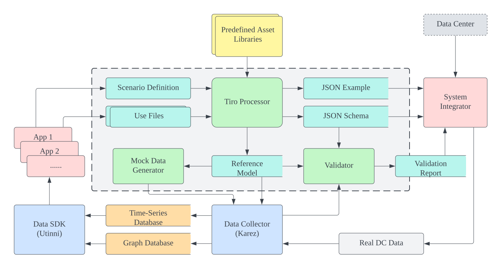

# Why Tiro?

The idea of Tiro starts from the attempts to standardize the protocol to collect data from data centers for DCWiz system. It has then been extended to a complete toolchain for DCWiz data workflow.

Tiro tries to solve the following problems:

1. How to share a standard data model for IoT system among different module developers and system integrators? The data users and data collector are usually different people. The data model should be able to be shared and understood by both of them.

2. How to ease the data interface development? Tiro tries to extract the common pattern of the data interface development and automate the process. The data interface developer should only focus on data themselves and the toolchain can handle the rest.

3. How to decouple the development between data collector and data user? The data collector should be able to develop the data interface without knowing the data user. The data user should be able to use the data without knowing the data collector. More specifically, 

    1. There should be a simple way for data users to declare their data requirements and a simple way for data collectors to collect the requirements from different users and fulfill them. This requires the tools to collect and assemble the requirements from different users, the tools to convert the collected data to standard model, and the tools to validate the collected data.
       
    2. Also, the data user's development should not be blocked by the data collector's development. Since the requirements and shared data models are clearly defined, there should be some data mockers to generate mock data, based on the requirements and mode, for the data user to conduct their development first.

4. How to properly organise the data collected from heterogeneous data sources in databases or storages, and how to provide the data to upper services and applications in a unified manner? The data collected from different data sources should be stored in a unified way. Lucky, we have already developed libraries [Karez](https://github.com/cap-dcwiz/Karez) and [Utinni](https://github.com/cap-dcwiz/Utinni) for collecting and using data from heterogeneous sources. Tiro can be plugged into the architecture by providing proper Karez roles and Utinni `DataPump`.

Therefore, Trio provides tools as shown in the following workflow, which covers the whole process of data collection, data validation, data exchanging, mock data generation and finally data usage.

One example use scenario of Tiro is shown in the following figure, where the data collection development and data usage development can be parallelized.

In this figure, above the dashed line is the data collection development, and below the dashed line is the data usage development. The data collector can develop the data collection interface without interfering the data user. Instead, they can validate the data independently. The data user can develop their data usage actually connecting to the real system. Instead, they can use the mock data to develop their data usage first. 

After both development works are done, the system integrator can simply replace the mock data generator will the real data collector, or replace the validator with the real application, the system should be ready to go. That standard data model that shared between both sides should be able to ensure there is no mismatch between the data collector and data user.